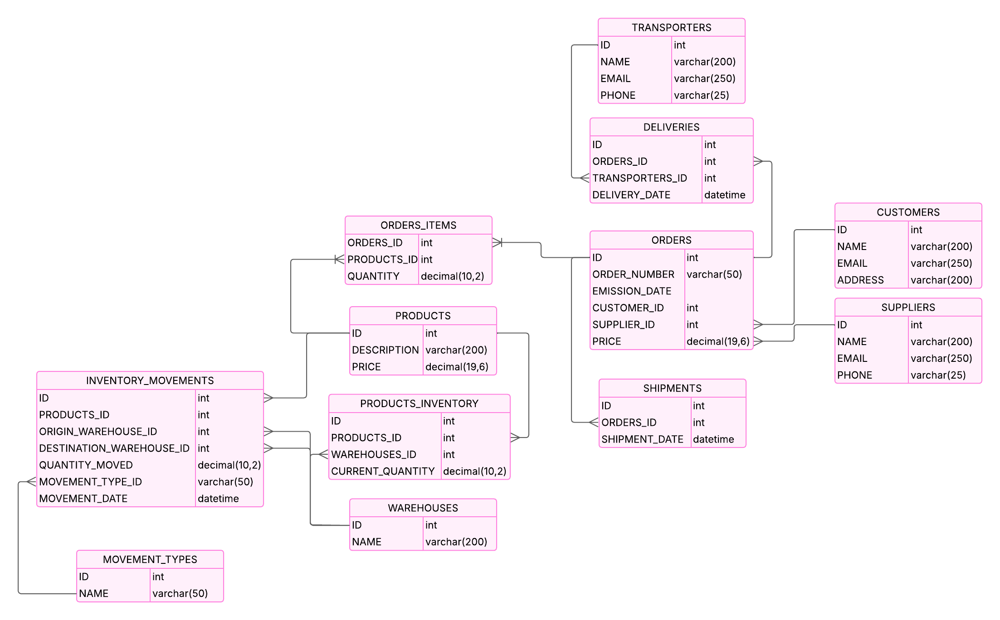
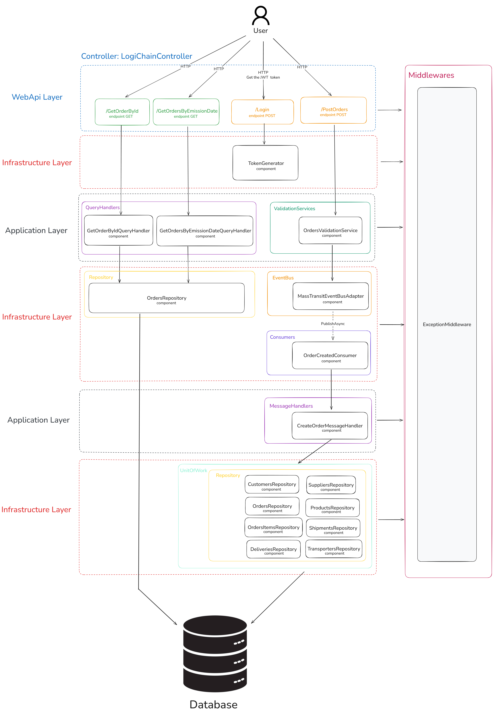

# 🚚 Supply Chain & Logistics Management System (C#)

A backend system built with C# focused on managing logistics and supply chain operations. This project demonstrates clean architecture principles using CQRS, Repositories, Unit of Work, and Messaging with RabbitMQ, designed for scalability, modularity, and testability.

## 🏛️ Architecture Overview

```
Csharp.SupplyChainLogisticManagement/
├── Domain/             # Enterprise/domain entities & business rules
├── Application/        # Business logic & use cases
├── Infrastructure/     # External concerns (database, file systems, etc.)
├── WebApi/            # User interface & API endpoints
└── UnitTests/         # Unit tests for all layers
```

## 🗃️ Entity-Relationship Diagram (ERD)
This diagram illustrates the relationships between core entities such as Order, Customer, Supplier, and others used in the domain layer.


## 🧩 Component Design Diagram
Below is a simple component design diagram, meant to illustrate the data flow between the layers and components of this architecture.


## 📦 Features

- 📄 Order Management: Create, read, and manage orders.
- 👤 Customer & Supplier Integration: Connect and store customer/supplier data via messages.
- 🔐 JWT Authentication: Secure endpoints using token-based authentication
- 📬 Asynchronous Communication: Process events like OrderCreatedMessage using RabbitMQ.
- 📚 Domain-Driven Design: Clear separation of concerns using application, domain, and infrastructure layers.
- 🧪 Unit Testing: Handlers and repositories tested to ensure reliability and correctness.


## 🏗️ Tech Stack

- **.NET 8** – Core framework
- **C#** – Primary programming language
- **Entity Framework Core** – Data access (or custom Repositories & Unit of Work)
- **SQL Server** – Relational database (can be switched)
- **RabbitMQ** – Message broker for asynchronous communication
- **JWT (JSON Web Tokens)** – Secure authentication and authorization
- **Swagger / Swashbuckle** – Interactive API documentation and testing
- **CQRS Pattern** – Separation of commands and queries
- **xUnit / NUnit** – Unit testing frameworks


## Getting Started 🚀
Follow these steps to get the project up and running in your development environment.

### Prerequisites 📋
- .NET SDK 8.0+
- Docker and Docker Compose
- SQL Server (or compatible database)

### Running the Project ▶️
1. **Clone the repository:**
   ```bash
   git clone https://github.com/your-user/your-repo-name.git
2. **Navigate to the project directory:**
   ```bash
   cd Csharp.SupplyChainLogisticManagement
3. **Build and start the services using Docker Compose:**
   ```bash
   docker-compose up --build
4. **Restore dependencies**
   ```bash
   dotnet restore
5. **Set up your environment variables or modify appsettings.json:**
- Database connection string
- JWT secret, issuer, and audience
- RabbitMQ hostname, port, and credentials
6. **Apply EF Core migrations (if using EF)**
   ```bash
   dotnet ef database update  
7. **Run the project**
   ```bash
   dotnet run
8. **(Optional) Run tests**
   ```bash
   dotnet test

### Accessing Services 🌍
- **RabbitMQ**: `http://localhost:15672`

## Contribution 🤝

Contributions are welcome! Feel free to submit issues or pull requests for improvements.

---

Feel free to explore and adapt the code for your own projects. Happy coding! 💻
